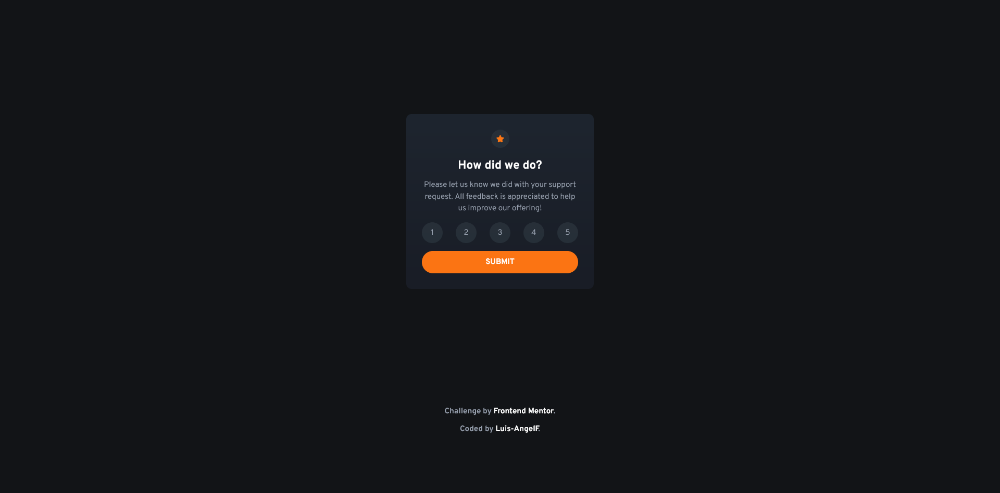

# Frontend Mentor - NFT preview card component solution

This is a solution to the [Interactive rating component challenge on Frontend Mentor](https://www.frontendmentor.io/challenges/interactive-rating-component-koxpeBUmI). Frontend Mentor challenges help you improve your coding skills by building realistic projects. 

## Table of contents

- [Overview](#overview)
  - [Screenshot](#screenshot)
  - [Links](#links)
- [My Process](#my-process)
  - [Built with](#built-with)
  - [Useful resourses](#useful-resources)
- [Author](#author)

## Overview

### Screenshot

### Links
- Live Site URL: [Netlify]()

## My Process

### Built with

- Semantic HTML5 markup
- Css custom properties
- Flexbox
- Mobile-first workflow
- Javascript

### Useful Resources

- [Reset CSS](https://meyerweb.com/eric/tools/css/reset/) - This helped me for reset default styles of css
- [NextJS](https://nextjs.org/) - This helped the development this site

## Author

- Frontend Mentor - [@Luis-AngelF](https://www.frontendmentor.io/profile/Luis-AngelF)